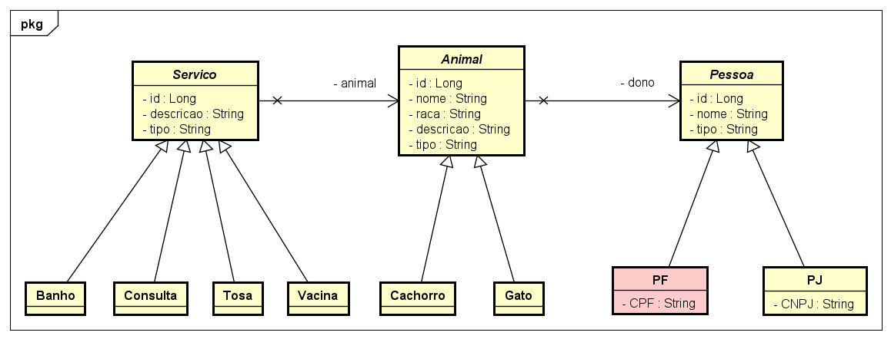

# JavaPet Benezinho  🤓👍🏾

CHECKPOINT - Domain Driven Development aplicado em 06/10/2023.


|                | **Domain Driven Development** |
|------------------------------------------|-------------------------------|
| **ALUNO:**                               | **TURMA:** 1TDSA 2023         |
| **PROFESSOR:** Benefrancis do Nascimento | 06/10/2023                    |
| **Checkpoint**                           |                               |

# Sumário


[Estudo de caso ](#_Estudo_de_caso)

[O que deverá ser feito? ](#_O_que_devera_ser_feito)

[Diagrama de Classes ](#_Diagrama_de_Classes)

[Correção ](#_Correcao)

<a id="_Estudo_de_caso"></a>

# Estudo de caso


A Holding Benezinho  deseja atuar no ramo de Petshop fornecendo servços de Banho, Tosa, Vacinação e Consultas Veterinárias, entretanto não conseguiu encontrar no mercado um sistema para gerir este novo negócio.
Contratamos você como Engenheiro de Software para ajudar a construir esse sistema.

Na sprint atual, você foi incumbido de fazer:

1. A persistência de todos os dados, e;

4. A criação de dos métodos capazes de realizar operações respeitando as interfaces genéricas Repository, Service e Resource:

        1. Consulta todos os objetos findAll;
        2. Consulta Objeto pelo Id findById;
        3. Persistência do Objeto;


<a id="_O_que_devera_ser_feito"></a>

# O que deverá ser feito?


**Faça o Fork do projeto no github do professor :**

https://github.com/Benefrancis/javapet.git

Caso o github esteja indisponível, você deverá pegar o projeto no diretório compartilhado.

**Você deverá:**

Alterar o arquivo contido em documentacao/equipe.txt para incluir os RMs e nomes e turma da dupla que fará esta atividade.


1. **(10 Pontos)** Implementar corretamente os métodos das classes que devem implementar a interface genérica **Repository**

   Deverá implementar:

    1. (3 Pontos) AnimalRepository, AnimalService e AnimalResource:
       1.   (0,5) public List<Animal> findAll()
       2.   (0,5) public Animal findById(Long id)
       3.   (2,0) public Animal persiste(Animal animal)
    2. (5 Pontos) ServicoRepository, ServicoService e ServicoResource:
       1.   (1,0) public List<Servico> findAll()
       2.   (1,0) public Servico findById(Long id)
       3.   (3,0) public Servico persiste(Servico servico)
    3. (2 Pontos) PJRepository, PJService e PJResource:
       1.   (0,5) public List<PJ> findAll()
       2.   (0,5) public PJ findById(Long id)
       3.   (1,0) public PJ persiste(PJ pessoa)
 

<a id="_Diagrama_de_Classes"></a>

# Diagrama de Classes de Domínio




<a id="_Correcao"></a>

# Correção da Prova

A correção da prova será disponibilizada no github do professor (branch correcao):

Para acessar digite no prompt:

```shell
git clone https://github.com/Benefrancis/javapet.git && cd javapet && git checkout correcao
```

A atividade é em dupla, em caso de fraude de qualquer tipo todos os envolvidos receberão nota ZERO.

Boa prova.
